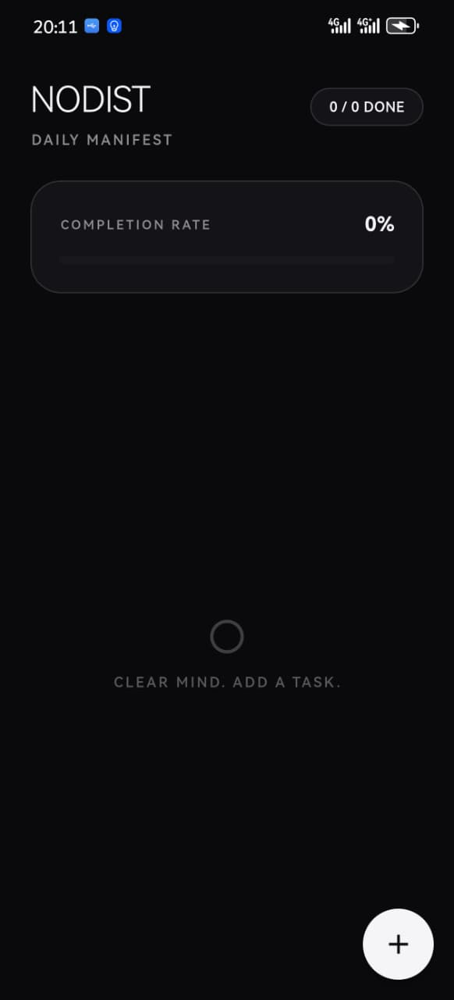
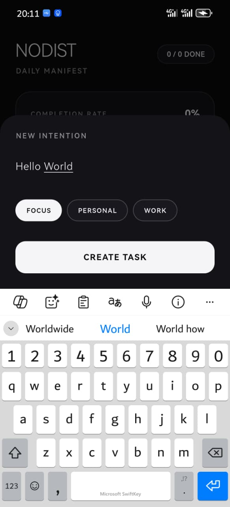
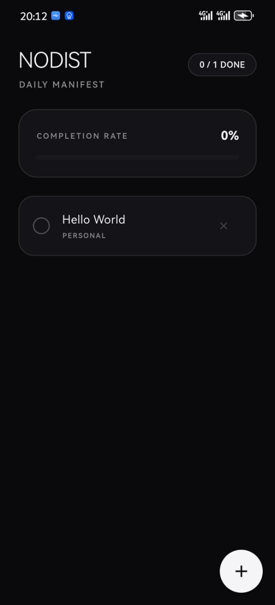

# Nodist ⚡ Minimalist Task Engine

> A high-contrast, distraction-free task management client engineered for daily execution and clarity. Built with Flutter, Dart, and offline-first local persistence.

---

## 📸 App Preview

<p align="center">
   
   
   
   
   
</p>

---

## ✨ Features

- **Monochrome & High Contrast:** Modern minimalist aesthetic designed to eliminate cognitive clutter and maintain focus.
- **100% Offline-First:** Zero reliance on remote servers. All application state is stored securely on-device via key-value local storage.
- **Velocity Metrics:** Real-time completion HUD with dynamic progress calculation.
- **Categorized Streams:** Organize directives effortlessly into Focus, Work, and Personal contexts.
- **Tactile Micro-Interactions:** Smooth haptic feedback on state changes, task creation, and dismissal.
- **Lightweight Architecture:** Instant cold-start times with minimal memory footprint.

---

## 🛠️ Tech Stack & Dependencies

- **Framework:** [Flutter](https://flutter.dev/) (Channel Stable)
- **Language:** [Dart](https://dart.dev/)
- **Local Persistence:** [`shared_preferences`](https://pub.dev/packages/shared_preferences)
- **Animation & Loaders:** [`flutter_spinkit`](https://pub.dev/packages/flutter_spinkit)
- **System Services:** `flutter/services.dart` (HapticFeedback, SystemChrome)

---

## 🚀 Getting Started

### Prerequisites

- [Flutter SDK](https://docs.flutter.dev/get-started/install) installed (`>=3.0.0`)
- Android Studio / VS Code with Flutter extension
- An Android device or emulator running API 21+

### Installation & Run

1. **Clone the repository:**
   ```bash
   git clone [https://github.com/K-Moeti/nodist.git]
   cd nodist
